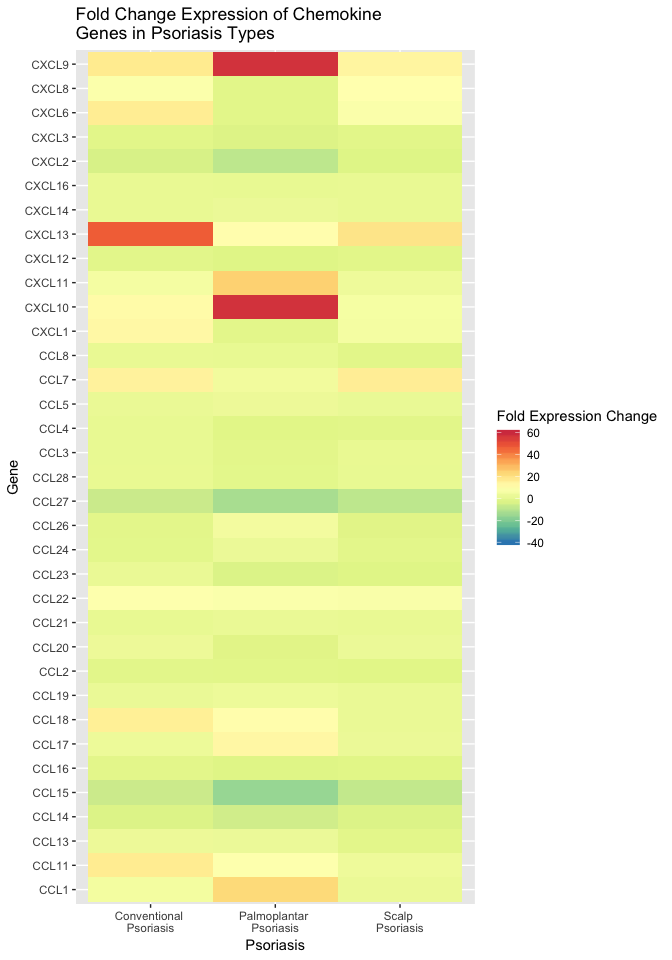

Cellular Processes Implicated in Psoriasis and their Differences in
Psoriasis Subtypes
================
Evan Henley
December 6, 2018

# Introduction

Psoriasis is an autoimmune-like disease isolated mainly to the skin that
affects around 125 million individuals across the globe (Griffiths *et
al.*, 2017). The disease manifests itself as itchy and inflamed lesions
on the skin that grow excessively. These lesions appear in various parts
of the body on individuals and can be so severe that they can cover
large portions of the body such as the entire back or on extremities.
These lesion can prove quite bothersome to individuals as they may
constantly scratch the lesions, further agitating the area and worsening
the disease. Moreover, this scratching can even lead to breaking down of
the skin barrier, which acts as a first defense against pathogens. By
reducing this defense, it allows for a greater chance of pathogen
introduction, putting the individual at greater risk for infection
(Bartenjev *et al.*, 2000). Older therapies such as Goeckerman therapy
and bleach baths, usually used in atopic dermatitis, have been used to
treat the symptoms, stopping growth of the skin or killing bacteria that
may irritate the lesions (Gupta *et al.*, 2013; Huang *et al.*, 2009).
Despite their relative success, the treatments are more short term and
do not actively address the problem of immune dysfunction within the
skin. Recent therapies such as Ustekinumab have be introduced that
specifically target pathways in the immune response to avoid this
overactive immune behavior, and consequently stop the lesions all
together (McKeage, 2014).

The pathophysiology of psoriasis is heavily mediated by the immune
system, specifically T cell. Keratinocytes are triggered by a factors
such as stress, which induces them to release cytokines (Lande *et al.*,
2007). These cytokines then activate T cells, namely Th1 and Th17, which
further enhance this immune response by releasing more cytokines that
introduces other immune cells. This activation leads to inflammation
within the lesion microenvironment, which further triggers keratinocytes
to start actively proliferating, a response usually induced to shed
possible pathogens. Since this initiation of the immune response is
heavily initiated by T cells, studying these cells are a major area of
interest. Specifically what may be of interest is how these cells are
affected in terms of their typical cellular functions. Many cellular
functions in the immune system have been researched as being key to
immune function. Changes in these critical cellular processes may be key
to the dysfunction seen in many autoimmune disease, including psoriasis.
Cell adhesion is a key process that enables the physical movement of
immune cells into the blood vessels and to sites of inflammation via
cell receptors such as selectins (Afanasiev *et al.*, 2013). Cytokines
and their chemokine subsets are a major signaling proteins in the immune
system that can trigger inflammation and homing of immune cells to
specific sites (Baliwag *et al.*, 2015; Lee and Hwang, 2012). Inhibitory
mechanisms such as CTLA4 and PD1 are major receptors involved in
inhibition of immune cells in disease like cancer, dampening the immune
system (Hernandez-Chacon *et al.*, 2011; Krummel, 1995). Lastly, cell
proliferation via clonal expansion of immune such as T and B cells are
what largely drive the inflammation as more inflammatory cells are
produced (Denizot *et al.*, 1986; Prakken *et al.*, 2000). Taken
together, these functions are critical in the immune response, and any
dysfunction in these would likely have some degree of effect in normal
immune function in disease such as psoriasis.

Given that there are so many key processes used by the immune system, we
decide that we wanted to look closer at these in psoriasis. Specifically
we wanted to see how they were affected in psoriasis, and if there were
any major changes between subtypes. In order to investigate this, we
looked at major differences in these processes on the genetic level. We
did so by using the RNA sequencing data originally generated by (Ahn *et
al.*, 2018) from active psoriasis lesions and healthy control. They
specifically looked at the psoriasis lesions from patients with
conventional psoriasis, palmoplantar psoriasis, and scalp psoriasis to
look for any molecular changes. All of these subtypes differ mainly in
the location to which the lesions are expressed, indicating some likely
different immune dysfunction phenotypes. Moving forward with this idea,
we looked at how cellular processes were affected in psoriasis in
general. We then honed in specifically on the major process affected and
sought to understand how these differed specifically across the
different psoriasis types. We hypothesized that cell adhesion mechanisms
will be reduced, likely in regulatory populations, and migration,
inhibition, inflammation, and proliferation mechanisms will be
increased, likely in the effector and regulatory populations, in
psoriasis so as to favor the autoimmune response. We further built on
this and hypothesized that the degree to which these are affected will
different between psoriasis type so as favor the phenotype that is key
in that specific disease. All together, we aim to gain better
understanding in the processes affected in psoriasis and how these may
be slightly altered between different subtypes. We hope that these
finding may shed some more light onto the exact mechanisms affected in
each subtype so that more targeted therapies can be created to
specifically treat the exact dysfunctionalities in each subtype.

# Methods

## Study design

The original aim (Ahn *et al.*, 2018) was to identify the heterogeneity
on molecular level with in psoriasis patients. They did so by using
RNA-Seq in order to identify the differences in gene expression as well
as flow cytometry to quantify T cell make-up. Their study essentially
consisted of isolating skin samples from psoriasis patients and healthy
control skin to extract the RNA and analyze the cells via flow
cytometry. The design consisted of 3 experimental groups: scalp
psoriasis, palmoplantar psoriasis, and conventional plaque psoriasis. A
control group was included as well using a healthy control group. Two 4
mm samples were taken from the active psoriatic lesions of the
experimental group skin and from the healthy control skin. For each skin
sample, 1 biopsy was used for RNA-Seq analysis and the other was used
for flow cytometry analysis. The individuals from which the psoriatic
skin was obtained were at least 18 years old and were confirmed to have
psoriasis for a minimum of 6 months. Individuals with psoriasis were not
on systemic treatments and abstained from topical treatments for at
least 2 weeks so as to not interfere with the data. The study design
allowed for the comparison of all psoriasis types between each other as
well as with healthy controls

## Sample origin and sequencing

For the experimental groups, a total of 19 patients with psoriasis were
recruited from the San Francisco Bay area. Of these patients, 8 had
conventional plaque psoriasis, 8 had scalp psoriasis, and 3 had
palmoplantar psoriasis. Two 4 mm punch biopsies were taken from active
lesions on the trunk and extremities of the conventional plaque
psoriasis, on the scalp of scalp psoriasis patients, and on the hand or
foot of the palmoplantar psoriasis patients. For the control group, skin
was isolated from the trunk or upper legs of 9 patients. The healthy
control skin was obtained from the surgical discards as a results of
cosmetic surgery performed on these patients. The biopsies for RNA-Seq
were placed in RNALater to preserve the RNA. The biopsies for flow
cytometry were placed on gauze dampened with phosphate buffered saline
to keep the skin hydrated. All biopsies were then stored at 4 °C until
processing of the samples.

The RNA was extracted from the biopsies started in RNALater using first
the Qiagen Allprep DNA/RNA mini kit. Once extracted, quality control and
identification of mRNA with little degradation was performed on the
Agilent 2100 bioanalyzer in order to filter out any suboptimal mRNA that
may interfere with analysis. The quality mRNA that was not discarded was
then prepared into a library either the Ovation RNA-Seq System V2
protocol (Nugen) or the Ribozero (Illumina) kits. The prepared libraries
were then sequenced on the Illumina Hiseq platform (Metzker, 2010). The
reads obtained were paired-end and maintained a 100 bp length.

## Computational

The data from (Ahn *et al.*, 2018) used for this analysis were download
from the Gene Expression Omnibus using the accession number GSE117405
using the SRA toolkit. The FASTQ files were then used to perform quality
control of the reads within the files based on the quality scores
assigned to the reads. This allowed for the visualization of suboptimal
quality regions of reads. The trimmomatic program was used to then
identify these lower quality regions of reads and trim them if their
quality score begins to fall below the threshold of 15 (Bolger *et al.*,
2014). Once the reads were cleaned to avoid errors from read sequences,
the data was then ready for further processing. The human reference
genome, transcripts, and annotation were downloaded from the NCBI RefSeq
database in order to align the trimmed reads to the genome in order to
identify the genes expressed. The biomartr program was used to download
these data as it allows for a controlled and reproducible manner of
retrieving such information (Drost and Paszkowski, 2017). Once this data
was obtained, the reads were ready to be aligned. The sailfish package
was used in order to index the reads and align them to the provided
reference genome (Patro *et al.*, 2014). Counts of these aligned reads
were then generated using the same package. These aligned transcripts
were then identified via their GenBank IDs, which were used to obtain
the gene names of these transcripts. Counts were ultimately consolidated
into a single gene count table containing normalized and non-normalized
gene counts which could be used for analysis.

The prepared data table was then analyzed in RStudio to produce the
graphs here. Data was manipulated to look at expression of genes of
interest via normalized counts across the conditions to see changes in
psoriasis and the types of psoriasis. The non-normalized counts were
also used to perform differential analysis via DESeq2 for figure 2 in
order to cluster samples based on the top 1000 gene differentially
expressed genes (Love *et al.*, 2014).

# Results

We first wanted to identify the major cell mechanisms affected in
psoriasis in general, specifically cell adhesion, cytokines, chemokines,
inhibition, and proliferation. We looked at the gene sets involved in
these mechanisms to see which mechanisms were upregulated or
downregulated. We calculated fold changes in expression to see how
upregulated or downregulated certain processes were in psoriasis in
general.

**Figure 1**: Bar plot of major gene sets involved in key cellular
processes that are upregulated or downregulated in psoriasis.

We first found that the expression levels of most of these cellular
processes were largely affected, except for two. Specifically,
proliferation, inhibition, and chemokines were all largely upregulated
(figure 1). Meanwhile, cell adhesion was one process that was largely
downregulated (figure 1). Proinflammatory cytokines trended towards
downregulation and proinflammatory cytokine receptors trended towards
upregulation, but not enough to keep moving forward with these (figure
1). Using this information, we decided to look more closely at those
processes that were largely affected across the different psoriasis
types.

Before moving forward and looking more in-depth at these cellular
processes, we decided to look more closely into the different subtypes
in general. We wanted to gain more insight into these subtypes and gain
some more information on exactly how they relate. More specifically, we
wanted to see how exactly similar they were and if they showed some
distinct
phenotypes.

**Figure 2**: PCA plot of the 4 sample groups to infer how the
phenotypes of psoriasis differ based on the top 1,000 differentially
expressed genes.

In order to gain some idea of relatedness between the psoriasis
subtypes, we used a principal component analysis approach to calculate
the differential expression of the top 1000 variably expressed genes.
Using this allowed us to infer some idea of relatedness based on the
difference in expression of certain genes. We saw that there was some
degree of aggregation across the psoriasis subtypes (Figure 2). The
healthy controls congregated cleanly together (Figure 2). The subtypes
congregated to some extent but there was some overlap between
conventional psoriasis and scalp psoriasis (Figure 2). Moreover, the
points within each group varied largely on the PC1 axis and to a lesser
extent on the PC2 axis (Figure 2).

Now that we had some idea of relatedness, we then moved forward as
stated before. We began by looking at the upregulation or down
regulation via fold change across the different subtypes to see how
these changed. We wanted to see if there were many changes from one
subtypes to
another.

**Figure 3**: Heatmap looking at the fold change expression of
inhibitory ligands and cytokines amongst the psoriasis subtypes.

We began by looking at the fold change expression of inhibitory ligands
and cytokines to see how their expression changed. We found that there
was an overall upregulation as in figure 1 (Figure 3). There was some
degree of variability in the expression of this upregulation, however,
for many the genes (Figure 3). Additionally, there were some genes that
were downregulated overall such as CD160 and even one gene that was
slightly downregulated in only palmoplantar psoriasis, LGALS9 (Figure
3).

**Figure 4**: Heatmap looking at the fold change expression of
inhibitory receptors amongst the psoriasis subtypes.

We then moved to look at the fold change expression of inhibitory
receptors across the subtypes. We found an overall upregulation as well,
similar to figure 1 (Figure 4). There was much less variability in the
degree of upregulation of these genes across the subtypes (Figure 4).
Despite this, HAVCR2 was one gene that was slightly downregulated in
only palmoplantar psoriasis and scalp psoriasis (Figure
4).

**Figure 5**: Heatmap looking at the fold change expression of chemokine
receptors amongst the psoriasis subtypes.

After inhibition, we started to analyze expression of chemokines,
specifically their receptors. There was mainly upregulation of these
genes for all subtypes, but there was also some downregulation of
certain genes as well such as CCR10, CCR9, and CXCR5 that was seen for
all three (figure 5). Again, the degree to which these were expressed
varied across subtype (figure 5). Additionally, CCR3, CCR6, and CCR8
were some receptors that were down regulated in only specific subtypes
(figure
5).

**Figure 6**: Heatmap looking at the fold change expression of
chemokines amongst the psoriasis subtypes.

We then analyzed expression of chemokines for these chemokine receptors.
There was very minimal downregulation of all chemokines looked at for
all subtypes, with some variability (figure 6). However, there were some
major upregulated chemokines for specific subtypes. CXCL10 and CXCL9
were upregulated mainly in palmoplantar psoriasis while CXCL13 was
mainly upregulated in conventional psoriasis (figure 6). There was also
some upregulation of certain chemokines for all subtypes, but to a much
less extent than these previous ones mentioned (figure
6).

**Figure 7**: Heatmap looking at the fold change expression of adhesion
molecules amongst the psoriasis subtypes.

We finally looked at the expression of adhesion molecules and found that
there was a mix of upregulation and downregulation, but downregulation
was more prominent (figure 7). These expression levels were seen
similarly across all the subtypes with some variability (figure 7).
There were some genes such as ICAM5 and ITGA10 that were downregulated
in only palmoplantar psoriasis and scalp psoriasis that were not seen in
conventional psoriasis (figure 7).

# Discussion

Psoriasis is a disease that results in a plethora of symptoms from
itching to soreness that leads to a lesser quality of life. Moreover,
these symptoms are due to dysfunction of the immune system and the
immune responses that are mounted. These dysfunctions have been
elucidated to some extent, identifying effector T cells as the
predominant cell types resulting in the inflammation within the active
psoriatic lesions. This research into these mechanisms of psoriasis have
given us insight into the pathophysiology of the disease and allowed us
to develop drugs to rescue these immune dysfunctions. Specifically, we
have been able to develop drugs that target certain immune activating
mechanisms such as cytokine release. Despite this, some drugs may not
work for individuals who have different types of psoriasis and many may
still experience symptoms. Our results here demonstrate some of the
major cellular processes affected in different types of psoriasis. Our
work aims to shed light on other aspects that are affected in psoriasis,
as it relates to the immune system, so that we may develop drugs to not
only treat symptoms, but that are targeted for the type of psoriasis a
patient has.

We first approached the data by looking at all of the gene cell
functions that may be affected in psoriasis in general compared to
healthy controls. We wanted to first find the most altered cellular
functions so that we could focus on these later when looking at the
different psoriasis types. We immediately found that cell adhesion was
decreased in psoriasis while proliferation, inhibition, and migration
(chemokines) were increased in psoriasis. It was surprising to find that
inflammation (cytokines) were not largely affected as it is these
molecules that are being released to initiate inflammation in the
psoriatic lesions. Despite this, these findings were generally in line
with our hypothesis that cell adhesion mechanisms would be reduced while
migration, inhibition, and proliferation mechanisms would be increased.
These findings made sense with the believed biology that is occurring in
these psoriatic lesions. The decreases in cell adhesion and increases in
inhibition is likely occurring with regulatory T cells. These cells are
known to infiltrate into sites of inflammation and dampen overactive
immune responses, especially those that may be autoimmune. These cells
are likely losing their adhesive proteins so that they cannot physically
attach as well to blood vessel walls to travel to the lesions and dampen
the immune response. These cells are also likely producing more
inhibitory receptors while effector cells causing the inflammation are
likely producing more inhibitory ligands and cytokines. This results in
the likely decrease in regulatory T cells so that they cannot perform
their necessary function in the lesion, permitting the autoimmune
behavior in the lesions to continue. The increase in migration is likely
occurring with the effector T cells as well as with other immune cell
types. These cells are producing more chemokines and chemokine receptors
so that they are being recruited much more efficiently to the lesions.
Given these observations, we decided to look further into these across
the psoriasis types. We decided to not look further into proliferation
as this could be occurring in the proliferating keratinocytes and/or in
the immune cells, making it difficult to really infer what is happening.

Before delving into our second set of approaches, we wanted to really
understand how the psoriasis phenotypes differed between each other.
This allows us to infer some idea of how different these psoriasis
subtypes are, likely meaning there may be different processes being
affected between psoriasis types. The psoriasis types appeared to
segregate to an extent, especially on the PC2 axis, based on the top
1000 differentially expressed genes. This indicates that there is to
some degree a difference between the psoriasis types. Although this
separation may not be significant, it appears to be trending towards
separation. Based on this, we expect the cellular processes we intend to
focus on to vary across the psoriasis types.

Our second set of approaches aimed to look at the differences in
inhibition, chemokines, and adhesion across the psoriasis types to see
if there may be some differences in the cellular processes affected.
Both inhibitory cytokines and ligands as well as their receptors were
all mostly increased across all psoriasis types. Most of the genes were
all similarly affected, but some genes were differentially affected.
LGALS9 was decreased in palmoplantar psoriasis and HAVCR2 was decreased
in palmoplantar and scalp psoriasis. These findings indicate that
certain inhibitory mechanisms are unaffected in certain psoriasis types.
These observations were similar across all cellular processes looked at.
For chemokines, the chemokine receptors CCR3, CCR6, and CCR8 and
chemokines CXCL9, CXCL10, and CXCL13 were all expressed differently to a
great extent across all the types. Again, these indicate that certain
chemokines are implicated more in certain psoriasis types than others.
Looking lastly at adhesion genes, many were expressed differentially
such as ICAM5 and ITGA10 in palmoplantar and scalp psoriasis. These
again appear to show that certain genes are differentially expressed
across psoriasis types. Altogether, the data make it evident that
although all these genes are affected similarly overall, certain genes
within the cellular processes are affected to different extents across
the psoriasis subtypes. Despite these differences, they still likely
contribute to the pathophysiology of the disease and possibly into why
these different psoriasis types exist.

Our results ultimately demonstrate that key cellular processes are
affected in psoriasis on the genetic level. The way in which these
cellular processes are affected are what likely favor the autoimmune
behavior seen in psoriasis. We show that these differences extend to the
different psoriasis types, but that these differences vary between these
types. Overall, these differences still contribute to the autoimmune
behavior that is occurring in psoriasis, but the specific genes that are
being affected may play a different role. It could be that the
differential expression of these genes in different psoriasis types is
what is actually causing these psoriasis types to occur. In other words,
these exact differences are the likely cause of why these lesions are
occurring on feet and hands in palmoplantar psoriasis and the scalp in
scalp psoriasis. Despite this, it also highlights the specific
mechanisms affected within the different cellular processes of the
psoriasis subtypes. This may explain why certain drugs may work for some
individuals but not for others. Moreover, this may give some insight
into drug development and how we may need to develop more drugs that are
targeted for certain psoriasis types based on these differences. We
anticipate that these results act as a starting point for understanding
the differences in the pathophysiology of psoriasis and its subtypes.
Furthermore, we hope that these results are taken into account when
developing drugs so that patients can get more targeted relief from
their symptoms.

# Sources Cited

Afanasiev,O.K. *et al.* (2013) Vascular e-selectin expression correlates
with cd8 lymphocyte infiltration and improved outcome in merkel cell
carcinoma. *Journal of Investigative Dermatology*, **133**, 2065–2073.

Ahn,R. *et al.* (2018) RNA-seq and flow-cytometry of conventional,
scalp, and palmoplantar psoriasis reveal shared and distinct molecular
pathways. *Scientific Reports*, **8**.

Baliwag,J. *et al.* (2015) Cytokines in psoriasis. *Cytokine*, **73**,
342–350.

Bartenjev,I. *et al.* (2000) Subclinical microbial infection in patients
with chronic plaque psoriasis. *Acta Dermato-Venereologica*, **80**,
17–18.

Bolger,A.M. *et al.* (2014) Trimmomatic: A flexible trimmer for illumina
sequence data. *Bioinformatics*, **30**, 2114–2120.

Denizot,F. *et al.* (1986) Clonal expansion of t cells: A cytotoxic
t-cell response in vivo that involves precursor cell proliferation.
*Proceedings of the National Academy of Sciences*, **83**, 6089–6092.

Drost,H.-G. and Paszkowski,J. (2017) Biomartr: Genomic data retrieval
with r. *Bioinformatics*, **33**, 1216–1217.

Griffiths,C. *et al.* (2017) The global state of psoriasis disease
epidemiology: A workshop report. *British Journal of Dermatology*,
**177**, e4–e7.

Gupta,R. *et al.* (2013) The goeckerman regimen for the treatment of
moderate to severe psoriasis. *Journal of Visualized Experiments*.

Hernandez-Chacon,J.A. *et al.* (2011) Costimulation through the
cd137/4-1BB pathway protects human melanoma tumor-infiltrating
lymphocytes from activation-induced cell death and enhances antitumor
effector function. *Journal of Immunotherapy*, **34**, 236–250.

Huang,J.T. *et al.* (2009) Treatment of staphylococcus aureus
colonization in atopic dermatitis decreases disease severity.
*Pediatrics*, **123**.

Krummel,M.F. (1995) CD28 and ctla-4 have opposing effects on the
response of t cells to stimulation. *Journal of Experimental Medicine*,
**182**, 459–465.

Lande,R. *et al.* (2007) Plasmacytoid dendritic cells sense self-dna
coupled with antimicrobial peptide. *Nature*, **449**, 564–569.

Lee,C.-H. and Hwang,S.T.-Y. (2012) Pathophysiology of chemokines and
chemokine receptors in dermatological science: A focus on psoriasis and
cutaneous t-cell lymphoma. *Dermatologica Sinica*, **30**, 128–135.

Love,M.I. *et al.* (2014) Moderated estimation of fold change and
dispersion for rna-seq data with deseq2. *Genome Biology*, **15**, 550.

McKeage,K. (2014) Ustekinumab: A review of its use in psoriatic
arthritis. *Drugs*, **74**, 1029–1039.

Metzker,M.L. (2010) Sequencing technologies—the next generation. *Nature
reviews genetics*, **11**, 31.

Patro,R. *et al.* (2014) Sailfish enables alignment-free isoform
quantification from rna-seq reads using lightweight algorithms. *Nature
Biotechnology*, **32**, 462–464.

Prakken,B. *et al.* (2000) T cell repertoire formation and molecular
mimicry in rheumatoid arthritis. *Current Directions in Autoimmunity
Rheumatoid Arthritis*, 51–63.

